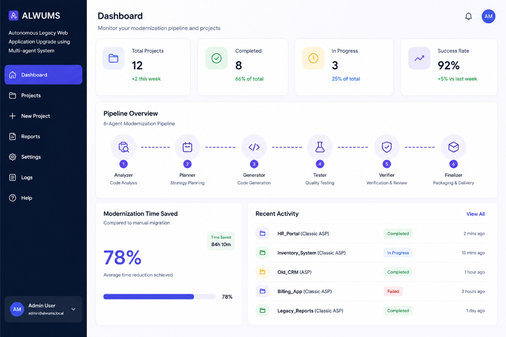
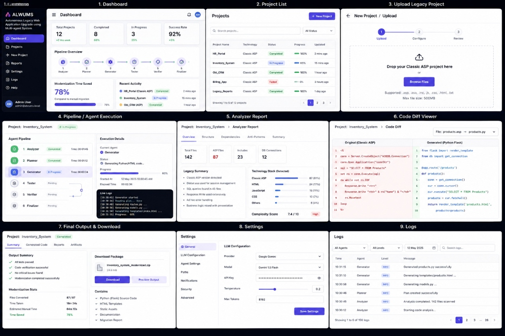

# ALWUMS — Autonomous Legacy Web Application Upgrade using Multi-Agent System
 
**Live Demo:** [alwums-modernizer-core.onrender.com](https://alwums-modernizer-core.onrender.com)
 
ALWUMS is a codebase modernization platform that migrates legacy systems (Classic ASP/VBScript, PHP) into modern, secure web architectures (ASP.NET Core Razor Pages, Python Flask, Node.js Express, React.js). A 6-agent pipeline powered by the Google Gemini API autonomously scans, analyzes, plans, refactors, tests, and validates legacy code — producing a fully modernized codebase with minimal human intervention.
 
**Impact:** 78% reduction in modernization time vs. manual refactoring.
 
---
 
## Screenshots
 
**Dashboard**

 
**Full Workflow — Upload, Pipeline, Diff Viewer, Reports, Logs**

 
---
 
## Key Features
 
- **Dual-Theme Dashboard** — light/dark mode, glassmorphic panels
- **Wizard-Driven Uploads** — 3-step migration configurator with folder scanning and auto-zipping
- **Live Multi-Agent Pipeline** — real-time status across Analyzer → Planner → Generator → Tester → Verifier → Finalizer
- **Analytics Reports** — file overview, structure tree, dependency mapping, anti-pattern detection, AI-generated summary
- **Code Diff Viewer** — side-by-side legacy vs. modernized code (red/green diff)
- **Single-Port Architecture** — Flask serves frontend + API together for simple cloud deployment
- **Self-Healing Validation** — Finalizer Agent auto-repairs failed files without reverting changes
- **Checkpoint & Cache** — `llm_cache.json` avoids repeated API calls, cuts cost, resumes interrupted runs
---
 
## Multi-Agent Pipeline
 
| # | Agent | Responsibility |
|---|-------|-----------------|
| 1 | **Analyzer** | Scans files, detects tech stack, maps dependencies |
| 2 | **Planner** | Builds refactoring checklist, flags deprecations/security risks |
| 3 | **Generator** | Refactors legacy code into the target stack |
| 4 | **Tester** | Runs syntax and basic runtime checks |
| 5 | **Verifier** | Checks styling extraction, encoding, and content integrity |
| 6 | **Finalizer** | Repairs failures, packages output + HTML migration report |
 
---
 
## Tech Stack
 
**Core:** Agentic AI orchestration, Google Gemini API (`gemini-2.5-flash`)
**Backend:** Python, Flask
**Frontend:** HTML5, Vanilla CSS3, Vanilla JS (JSZip, AJAX)
**Data:** MongoDB (migration target), JSON-based agent communication
 
**Supported migration targets:** React.js / Angular / HTML5 · Node.js Express / Flask / ASP.NET Core Razor · MongoDB / PostgreSQL / SQL Server
 
---
 
## Project Structure
 
```
alwums-modernizer-core/
├── agents/                   # Agent prompt definitions
├── project/                  # Sample legacy project
├── index.html / .css / .js   # Dashboard UI
├── universal_upgrader.py     # Flask orchestrator entry point
├── uni.py
├── requirements.txt
└── .env.example
```
 
---
 
## Setup
 
```bash
git clone https://github.com/Athiya-Farhanaz/alwums-modernizer-core.git
cd alwums-modernizer-core
pip install -r requirements.txt
```
 
Create a `.env` file (see `.env.example`):
```
GEMINI_API_KEY=YOUR_GOOGLE_GEMINI_API_KEY
```
 
Run:
```bash
python universal_upgrader.py
```
Open `http://localhost:5000`.
 
---
 
## Performance
 
- 78% reduction in modernization time vs. manual refactoring
- Autonomous detection of deprecated tech and security vulnerabilities
- Automatic validation and self-healing repair
- Cached LLM responses minimize redundant API calls
---
 
**Languages:** HTML · JavaScript · CSS · Python · Classic ASP · PHP
