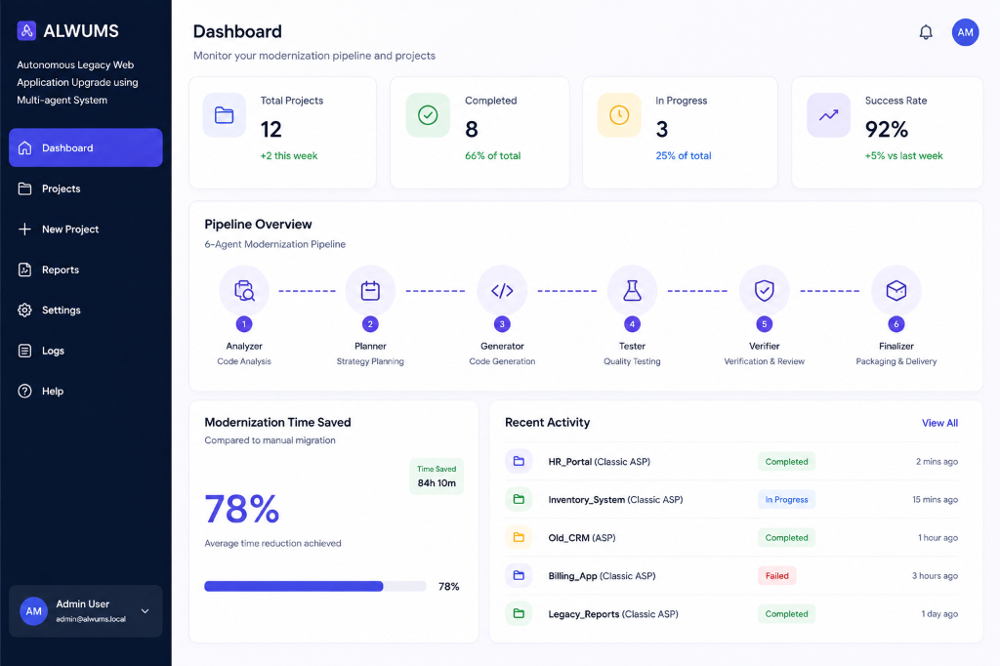
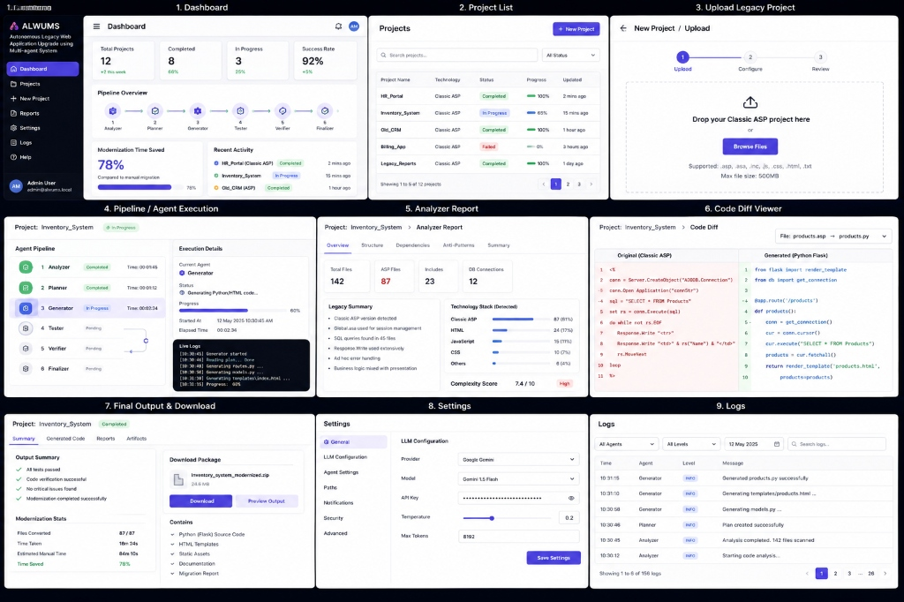

# ALWUMS — Autonomous Legacy Web Application Upgrade using Multi-Agent System
 
**Live Demo:** [alwums-modernizer-core.onrender.com](https://alwums-modernizer-core.onrender.com)
 
ALWUMS is a codebase modernization platform that migrates legacy systems (Classic ASP/VBScript, PHP) into modern, secure web architectures (ASP.NET Core Razor Pages, Python Flask, Node.js Express, React.js). A 6-agent pipeline powered by the Google Gemini API autonomously scans, analyzes, plans, refactors, tests, and validates legacy code — producing a fully modernized codebase with minimal human intervention.
 
**Impact:** 78% reduction in modernization time vs. manual refactoring.
 
---
 
## Screenshots
 
**Dashboard**

 
**Full Workflow — Upload, Pipeline, Diff Viewer, Reports, Logs**

 
---
 
## Key Features
 
- **Dual-Theme Dashboard** — light/dark mode, glassmorphic panels
- **Wizard-Driven Uploads** — 3-step migration configurator with folder scanning and auto-zipping
- **Live Multi-Agent Pipeline** — real-time status across Analyzer → Planner → Generator → Tester → Verifier → Finalizer
- **Analytics Reports** — file overview, structure tree, dependency mapping, anti-pattern detection, AI-generated summary
- **Code Diff Viewer** — side-by-side legacy vs. modernized code (red/green diff)
- **Single-Port Architecture** — Flask serves frontend + API together for simple cloud deployment
- **Self-Healing Validation** — Finalizer Agent auto-repairs failed files without reverting changes
- **Checkpoint & Cache** — `llm_cache.json` avoids repeated API calls, cuts cost, resumes interrupted runs
---
 
## Multi-Agent Pipeline
 
| # | Agent | Responsibility |
|---|-------|-----------------|
| 1 | **Discovery Agent** | Scans files, detects tech stack, maps dependencies |
| 2 | **Manager Agent** | Builds refactoring checklist, flags deprecations/security risks |
| 3 | **Prompt Maker Agent** | Builds context-aware prompts with migration requirements |
| 4 | **Execution Agent** | Refactors legacy code into the target stack using LLMs |
| 5 | **Validator Agent** | Confirms every planned task has been completed |
| 6 | **Finalizer Agent** | Creates runtime test environment, builds, executes, and repairs failures |
 
---
 
## Tech Stack
 
**Core:** Multi-Agent AI Orchestration, Google Gemini API (`gemini-2.5-flash`)
**Backend:** Python 3.11, Flask, Flask-CORS
**Frontend:** React.js 18, Vite (SPA with real-time logs & diff viewer)
**Database:** MongoDB (`pymongo`) — stores projects, execution logs, and prompt-caching checkpoints
**Virtualization:** Docker & Docker Compose (Multi-language runtime sandbox)
 
---
 
## Project Structure
 
```
alwums-modernizer-core/
├── agents/                   # 6 specialized agent prompt definitions
├── frontend/                 # React.js application source (Vite + React 18)
│   ├── src/components/       # Dashboard, PipelineTracker, DiffViewer, LogsView, UploadWizard
│   └── dist/                 # Production-built React bundle served by Flask
├── project/                  # Sample legacy test files (Classic ASP, PHP)
├── universal_upgrader.py     # Python Flask orchestrator & 6-agent engine
├── Dockerfile                # Multi-language runtime sandbox (Python, Node, PHP)
├── docker-compose.yml        # Flask service + MongoDB container orchestration
├── requirements.txt          # Python dependencies (Flask, pymongo, gunicorn, etc.)
└── .env.example
```
 
---
 
## Setup
 
```bash
git clone https://github.com/Athiya-Farhanaz/alwums-modernizer-core.git
cd alwums-modernizer-core
pip install -r requirements.txt
```
 
Create a `.env` file (see `.env.example`):
```
GEMINI_API_KEY=YOUR_GOOGLE_GEMINI_API_KEY
```
 
Run:
```bash
python universal_upgrader.py
```
Open `http://localhost:5000`.
 
---
 
## Performance
 
- 78% reduction in modernization time vs. manual refactoring
- Autonomous detection of deprecated tech and security vulnerabilities
- Automatic validation and self-healing repair
- Cached LLM responses minimize redundant API calls
---
 
**Languages:** HTML · JavaScript · CSS · Python · Classic ASP · PHP
